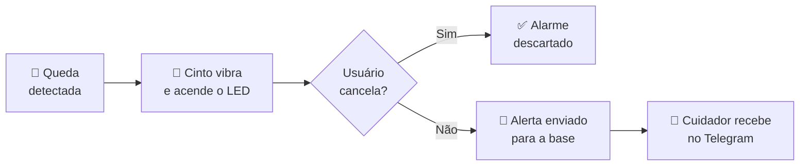
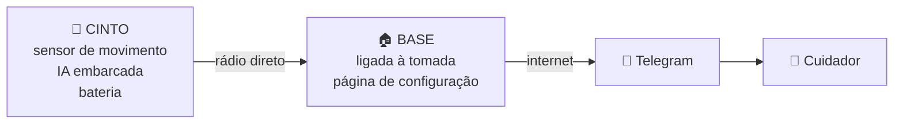

# 🔔 Cinto Alerta

### Um cinto que percebe a queda de um idoso e chama socorro sozinho

---

## O problema não é a queda. É o tempo no chão.

Quedas estão entre as principais causas de lesão e de perda de autonomia em pessoas idosas. Mas o que determina a gravidade não é apenas o impacto — é **quanto tempo a pessoa fica sem atendimento**.

Quem cai sozinho em casa e não consegue se levantar pode passar horas no chão. Nesse intervalo, lesões se agravam e o risco de complicações sobe.

A resposta óbvia — "ela liga para alguém" — falha exatamente quando é mais necessária. Se houve desmaio, fratura de quadril ou o celular ficou em outro cômodo, não há ligação nenhuma.

---

## Como funciona

O fluxo abaixo descreve o funcionamento previsto. A integração do firmware ainda
está em desenvolvimento; veja o estado atual e os comandos no [guia do master](master/README.md).

O cinto detecta a queda por conta própria, usando um sensor de movimento e um modelo de inteligência artificial que roda **dentro do próprio dispositivo** — sem internet, sem nuvem, sem enviar dados para lugar nenhum.

Se o usuário estiver bem, um toque no botão cancela. Se não houver resposta, o alerta segue para o celular de um familiar ou cuidador.

---

## O que o dispositivo faz

| | |
|:--:|:--|
| 🎯 | **Detecta quedas automaticamente** — sem depender de a pessoa apertar nada |
| 📳 | **Avisa antes de alarmar** — vibração e LED dão alguns segundos para cancelar |
| 🆘 | **Botão de socorro manual** — para mal-estar, dor ou confusão, que nenhum sensor detecta |
| 💬 | **Notifica pelo Telegram** — mensagem personalizável para cada cuidador |
| 🔋 | **Avisa quando a bateria está acabando** — antes de ficar desprotegido |
| 📶 | **Funciona sem depender do Wi-Fi da casa** — o cinto fala direto com a base |
| ⚠️ | **Avisa se o próprio aparelho parar** — um dispositivo mudo não é confundido com "está tudo bem" |

---

## Decisões de projeto

<b>Por que na cintura, e não no pulso?</b>

 

Foi a primeira decisão técnica do projeto, e talvez a mais importante.

A ideia original era um smartwatch — mais moderno, mais aceitável socialmente. O problema é que **o pulso é a pior posição possível para detectar quedas**.

O braço se move de forma independente do corpo. Bater a mão na mesa, aplaudir, escovar os dentes, tirar o relógio e apoiá-lo — tudo isso gera assinaturas muito parecidas com uma queda. O resultado é alarme falso constante, e um dispositivo que dá alarme falso todo dia é um dispositivo que o usuário desliga.

A cintura resolve isso porque **acompanha o centro de massa do corpo**: só se move de verdade quando o corpo inteiro se move.

<b>Por que existe uma janela de cancelamento?</b>

 

Detectar um impacto é fácil. Distinguir **"caiu"** de **"sentou rápido no sofá"** é o problema que a área ainda não resolveu bem.

A janela de cancelamento transforma um erro grave em um pequeno incômodo: sem ela, cada alarme falso é um susto na família; com ela, é um botão apertado.

E tem um bônus — cada cancelamento é um exemplo real de "isso não era queda", que serve para melhorar o modelo.

<b>Por que o aparelho avisa quando ele mesmo para de funcionar?</b>

 

Um cinto com bateria descarregada, travado ou fora de alcance é **indistinguível de um idoso que está bem** — nos dois casos o sistema fica em silêncio.

Um sistema de segurança cujo modo de falha é "não avisar nada" não é um sistema de segurança. Por isso o cinto envia sinais periódicos de "estou aqui", e a base avisa o cuidador se eles pararem de chegar — com uma mensagem diferente, deixando claro que o problema é o aparelho, não a pessoa.

---

## O sistema

A **base** fica ligada na tomada de casa e hospeda uma página de configuração acessível pelo celular, onde a família cadastra cada cinto, o nome do idoso, a mensagem de alerta e quem deve recebê-la.

Se a internet cair no momento do alerta, a base **guarda a ocorrência** e envia assim que a conexão voltar.

---

## Organização do repositório

| Caminho | Conteúdo |
|---|---|
| [master/](master/) | Firmware da base (ESP32-S3-DevKitC-1, N16R8): projeto PlatformIO com `include/`, `src/` e `test/` |
| [master/frontend/](master/frontend/) | Página de configuração (HTML/CSS/JS), servida do LittleFS da própria base |
| [master/prototypes/](master/prototypes/) | Experimentos fora da compilação do firmware (`telegram_call.cpp`) |
| [slave/](slave/) | Firmware do cinto (ESP32-S3 Super Mini): projeto PlatformIO |
| [shared/](shared/) | Cabeçalhos incluídos pelos dois firmwares (`-I../shared/include`): o protocolo de mensagens (`Protocol/Message.h`) e utilitários de MAC. Ficam num só lugar para base e cinto nunca divergirem |
| `docs/Plano_de_Projeto.pdf` | Plano do projeto entregue na disciplina |

Consulte o [guia da base](master/README.md) para compilar, testar, gravar o firmware e
abrir a interface localmente.

### Como o cinto é pareado com a base

O cinto sempre inicia. A base fica no canal Wi-Fi do roteador, que o cinto não conhece,
então o cinto varre os canais 1 a 13 enviando um pedido em broadcast.

1. Ao apertar o botão de pareamento, o cinto envia `PairRequest` em cada canal.
2. A base ouve, mostra o cinto em "Waiting to be set up" na página e responde `PairWait`.
   O cinto trava nesse canal e repete o pedido a cada 2 s enquanto o cuidador configura.
3. O cuidador escolhe o cinto, preenche nome, mensagem e destinatários e aperta **Save**.
4. A base envia `PairAccept` (com o seu canal). O cinto grava o MAC e o canal da base
   e responde `PairConfirm`.
5. Só então a base grava o MAC do cinto. Sem a confirmação, nada é gravado e a página avisa.

Todas as mensagens começam com um cabeçalho (`magic`, tipo e `seq`); a base e o cinto
descartam qualquer quadro que não bata com ele. O formato está em
[shared/include/Protocol/Message.h](shared/include/Protocol/Message.h).

### Estado do firmware do cinto

Implementado: botão de pareamento, varredura de canais e pareamento com aprovação do
cuidador, com o MAC e o canal da base gravados no LittleFS (sobrevivem a reinício). Ainda
não implementado: detecção de queda, vibração e LED com janela de cancelamento, envio do
alerta (a base já recebe `Alert` e responde `AlertAck`) e monitoramento de bateria.

---

## O que este projeto não é

> [!WARNING]
> **Não é um dispositivo médico.** É um protótipo acadêmico, sem validação clínica nem certificação regulatória.

- Os dados de treino vêm de quedas simuladas por adultos jovens e saudáveis. Quedas reais de pessoas idosas são diferentes — mais lentas, com menos reflexo de proteção, sobre piso duro.
- Depende de energia elétrica na casa, internet funcionando e um cuidador com celular acessível.
- **Não substitui presença humana.** Reduz o tempo até o socorro; não elimina o risco de cair.

---

## A equipe

Projeto desenvolvido para a disciplina de **Oficinas de Integração 2**
Engenharia de Computação · Universidade Tecnológica Federal do Paraná

**Rafael de Andrade Fernandes** · **Arthur Gabriel Pellegrini Heberle** · **Vinícius Romualdo Silva**

 

*Curitiba, PR · 2026*

