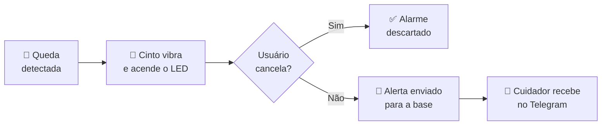
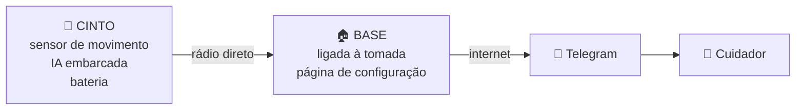

<div align="center">

# 🔔 Cinto Alerta

### Um cinto que percebe a queda de um idoso e chama socorro sozinho


</div>

---

## O problema não é a queda. É o tempo no chão.

Quedas estão entre as principais causas de lesão e de perda de autonomia em pessoas idosas. Mas o que determina a gravidade não é apenas o impacto — é **quanto tempo a pessoa fica sem atendimento**.

Quem cai sozinho em casa e não consegue se levantar pode passar horas no chão. Nesse intervalo, lesões se agravam e o risco de complicações sobe.

A resposta óbvia — "ela liga para alguém" — falha exatamente quando é mais necessária. Se houve desmaio, fratura de quadril ou o celular ficou em outro cômodo, não há ligação nenhuma.

---

## Como funciona

O fluxo abaixo descreve o funcionamento previsto. A integração do firmware ainda
está em desenvolvimento; veja o estado atual e os comandos no [guia do master](master/README.md).

<div align="center">



</div>

O cinto detecta a queda por conta própria, usando um sensor de movimento e um modelo de inteligência artificial que roda **dentro do próprio dispositivo** — sem internet, sem nuvem, sem enviar dados para lugar nenhum.

Se o usuário estiver bem, um toque no botão cancela. Se não houver resposta, o alerta segue para o celular de um familiar ou cuidador.

---

## O que o dispositivo faz

| | |
|:--:|:--|
| 🎯 | **Detecta quedas automaticamente** — sem depender de a pessoa apertar nada |
| 📳 | **Avisa antes de alarmar** — vibração e LED dão alguns segundos para cancelar |
| 🆘 | **Botão de socorro manual** — para mal-estar, dor ou confusão, que nenhum sensor detecta |
| 💬 | **Notifica pelo Telegram** — mensagem personalizável para cada cuidador |
| 🔋 | **Avisa quando a bateria está acabando** — antes de ficar desprotegido |
| 📶 | **Funciona sem depender do Wi-Fi da casa** — o cinto fala direto com a base |
| ⚠️ | **Avisa se o próprio aparelho parar** — um dispositivo mudo não é confundido com "está tudo bem" |

---

## Decisões de projeto

<details>
<summary><b>Por que na cintura, e não no pulso?</b></summary>

<br>

Foi a primeira decisão técnica do projeto, e talvez a mais importante.

A ideia original era um smartwatch — mais moderno, mais aceitável socialmente. O problema é que **o pulso é a pior posição possível para detectar quedas**.

O braço se move de forma independente do corpo. Bater a mão na mesa, aplaudir, escovar os dentes, tirar o relógio e apoiá-lo — tudo isso gera assinaturas muito parecidas com uma queda. O resultado é alarme falso constante, e um dispositivo que dá alarme falso todo dia é um dispositivo que o usuário desliga.

A cintura resolve isso porque **acompanha o centro de massa do corpo**: só se move de verdade quando o corpo inteiro se move.

</details>

<details>
<summary><b>Por que existe uma janela de cancelamento?</b></summary>

<br>

Detectar um impacto é fácil. Distinguir **"caiu"** de **"sentou rápido no sofá"** é o problema que a área ainda não resolveu bem.

A janela de cancelamento transforma um erro grave em um pequeno incômodo: sem ela, cada alarme falso é um susto na família; com ela, é um botão apertado.

E tem um bônus — cada cancelamento é um exemplo real de "isso não era queda", que serve para melhorar o modelo.

</details>

<details>
<summary><b>Por que o aparelho avisa quando ele mesmo para de funcionar?</b></summary>

<br>

Um cinto com bateria descarregada, travado ou fora de alcance é **indistinguível de um idoso que está bem** — nos dois casos o sistema fica em silêncio.

Um sistema de segurança cujo modo de falha é "não avisar nada" não é um sistema de segurança. Por isso o cinto envia sinais periódicos de "estou aqui", e a base avisa o cuidador se eles pararem de chegar — com uma mensagem diferente, deixando claro que o problema é o aparelho, não a pessoa.

</details>

---

## O sistema

<div align="center">



</div>

A **base** fica ligada na tomada de casa e hospeda uma página de configuração acessível pelo celular, onde a família cadastra cada cinto, o nome do idoso, a mensagem de alerta e quem deve recebê-la.

Se a internet cair no momento do alerta, a base **guarda a ocorrência** e envia assim que a conexão voltar.

---

## Organização do repositório

| Caminho | Conteúdo |
|---|---|
| `master/` | Master firmware — PlatformIO project (`include/`, `src/`, `test/`) targeting an ESP32-S3-DevKitC-1 (N16R8: 16 MB flash, 8 MB PSRAM) |
| `master/prompt.md` | Master's class diagram and per-class design notes (architecture source of truth) |
| `master/frontend/` | Config page (HTML/CSS/JS) served from the master's own LittleFS |
| `master/prototypes/` | Work in progress from other team members, not yet wired into the firmware above (see below) |
| `slave/` | Belt (slave) firmware — PlatformIO project targeting an ESP32-S3 Super Mini (ESP32-S3FH4R2: 4 MB flash, 2 MB PSRAM) |
| `slave/prompt.md` | Slave's class diagram, per-class design notes, and the task-by-task roadmap for the rest of the belt firmware |
| `shared/` | Wire-protocol and MAC-utility headers included by both `master/` and `slave/` (`-I../shared/include`), so they can never drift out of sync between the two firmwares |
| `docs/Plano_de_Projeto.pdf` | Project plan submitted for the course |

Consulte o [guia do master](master/README.md) para compilar componentes, executar
testes e abrir a interface localmente. A hospedagem do frontend no ESP32 e sua
conexão com as APIs ainda serão implementadas.

PlatformIO project (Arduino framework) implementing the master station: an always-on Wi-Fi
AP+STA with a config page served from LittleFS (`master/frontend/`), ESP-NOW pairing and
alert reception, asynchronous Telegram sends on FreeRTOS tasks with retry/backoff, and a
power-loss-safe retry queue on LittleFS. The domain model, storage, network and messaging
layers are covered by the Unity test suites under `master/test/`; see `master/README.md`
for build/flash/test instructions.

## Slave firmware (`slave/`)

PlatformIO project (Arduino framework) for the belt. Implemented so far: a pairing button that
listens for the master's broadcast to learn its MAC and replies so the master learns the belt's
MAC back (bidirectional ESP-NOW addressing, no manual MAC entry on either side), with the
learned master MAC persisted on LittleFS across reboots. Motion sensing/fall detection,
vibration+LED warning with a cancel window, alert transmission, and battery monitoring are not
implemented yet — see `slave/prompt.md`'s roadmap section for the planned, team-dividable tasks.

> [!WARNING]
> **Não é um dispositivo médico.** É um protótipo acadêmico, sem validação clínica nem certificação regulatória.

- Os dados de treino vêm de quedas simuladas por adultos jovens e saudáveis. Quedas reais de pessoas idosas são diferentes — mais lentas, com menos reflexo de proteção, sobre piso duro.
- Depende de energia elétrica na casa, internet funcionando e um cuidador com celular acessível.
- **Não substitui presença humana.** Reduz o tempo até o socorro; não elimina o risco de cair.

- `frontend/` — master configuration UI mockup (plain HTML/CSS/JS, meant to eventually be
  served from LittleFS). `app.js` starts with `const MOCK = true`: every call is served by
  `mock.js` (fake data, simulated latency). Run it locally with:
  ```bash
  cd master/prototypes/frontend
  python -m http.server 8000    # or: python3 -m http.server 8000
  # open http://localhost:8000
  ```
- `telegram_call.cpp` — standalone prototype for the Telegram Bot API HTTP call, independent
  from `master/src/Messaging/TelegramTask.cpp`.

<div align="center">

## A equipe

Projeto desenvolvido para a disciplina de **Oficinas de Integração 2**
Engenharia de Computação · Universidade Tecnológica Federal do Paraná

**Rafael de Andrade Fernandes** · **Arthur Gabriel Pellegrini Heberle** · **Vinícius Romualdo Silva**

<br>

*Curitiba, PR · 2026*

</div>
